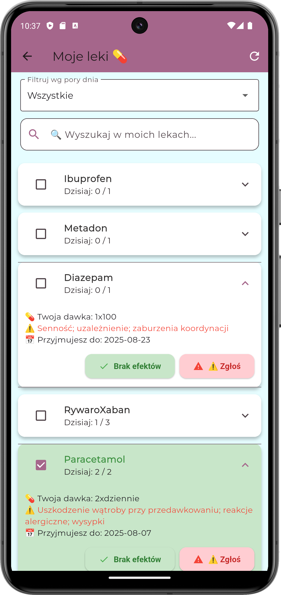
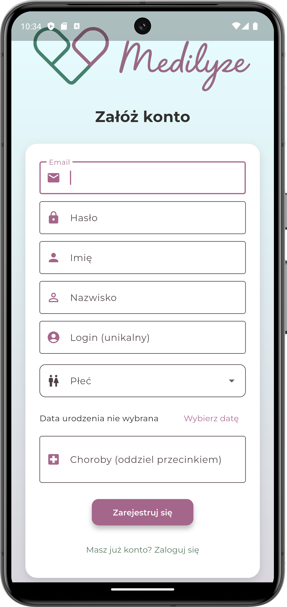
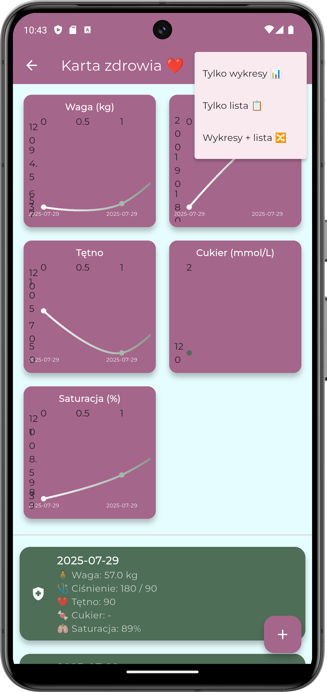

# MediLyze (Showcase)

Mobile app (Flutter) focused on safer polypharmacy: helping users track medications and get clear warnings about potential interactions — designed for the Polish market.

## Demo / Product deck
- Presentation: https://www.canva.com/design/DAG5K9y8EwU/nLQmwMrH7lAorpZX3nXvvw/view?utm_content=DAG5K9y8EwU&utm_campaign=designshare&utm_medium=link2&utm_source=uniquelinks&utlId=h8cdbce99b7

## What problem it solves
Many people take multiple medications and supplements. MediLyze helps organize daily intake and highlights potential interaction risks in a user-friendly way.

## Key features (MVP)
- Medication list + intake schedule
- Interaction warnings (drug–drug / drug–disease / drug-food) 
- Search and educational details (simple language)
- Designed for PL market (Polish trade names / conditions)

## Tech stack
- Flutter / Dart
- Backend: Supabase 
- Local/offline-first: Hive 

## Screenshots

## Architecture highlights
- Feature-first structure
- Clear separation of UI / state / data
- Sync-ready approach (offline-first patterns)

## Status
This repository is a public showcase (no sensitive data). Core code may be private.
